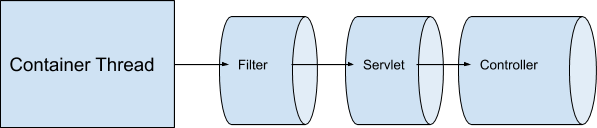
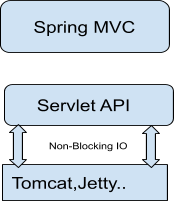
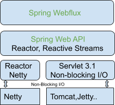

<!DOCTYPE html>
<html xmlns:ng="http://angularjs.org" id="ng-app" ng-app="TH" class="ng-scope" lang="en"><head ng-controller="DZHeadController" class="ng-scope">
<meta http-equiv="content-type" content="text/html; charset=UTF-8">
    <meta charset="utf-8">
    <meta http-equiv="X-UA-Compatible" content="IE=edge,chrome=1">
    <meta name="viewport" content="width=device-width, initial-scale=1">

    <meta name="description" ng-attr-content="{{ service.description }}" content="In this post, we glance at the options provided by Spring 5 for the Reactive and Async concurrency models, specifically Spring MVC and Spring WebFlux.">
    <meta name="keywords" ng-attr-content="{{ service.keywords }}" content="concurrency model,java,nio,servlet 3.0,spring,spring reactive,spring web flux,webflux">

    <meta property="og:description" ng-attr-content="{{ service.description }}" content="In this post, we glance at the options provided by Spring 5 for the Reactive and Async concurrency models, specifically Spring MVC and Spring WebFlux.">

    <meta ng-attr-content="{{ service.noIndex ? 'noindex' : '' }}" ng-attr-name="{{ service.noIndex ? 'robots' : '' }}" name="" content="">

    <meta property="og:site_name" ng-attr-content="{{ service.siteName }}" content="dzone.com">
    <meta property="og:title" ng-attr-content="{{ service.title }}" content="Understanding Spring Reactive: Introducing Spring WebFlux - DZone Java">
    <meta property="og:url" ng-attr-content="{{ service.canonical }}" content="https://dzone.com/articles/understanding-spring-reactiveintroducing-spring-we">
    <!-- ngIf: service.img --><meta ng-if="service.img" ng-attr-content="{{ service.img }}" property="og:image" content="//dz2cdn3.dzone.com/storage/article-thumb/10372210-thumb.jpg" class="ng-scope"><!-- end ngIf: service.img -->
    <!-- ngIf: service.type --><meta ng-if="service.type" ng-attr-content="{{ service.type }}" property="og:type" content="presentation" class="ng-scope"><!-- end ngIf: service.type -->

    <meta name="twitter:site" content="@DZoneInc">
    <!-- ngIf: service.twitterImage -->
    <meta name="twitter:card" content="summary_large_image">
    <meta name="twitter:description" ng-attr-content="{{ service.description }}" content="In this post, we glance at the options provided by Spring 5 for the Reactive and Async concurrency models, specifically Spring MVC and Spring WebFlux.">
    <meta name="twitter:title" ng-attr-content="{{ service.title }}" content="Understanding Spring Reactive: Introducing Spring WebFlux - DZone Java">

    <!-- ngIf: service.wordCount --><meta ng-if="service.wordCount" property="article:wordcount" ng-attr-content="{{service.wordCount}}" content="901" class="ng-scope"><!-- end ngIf: service.wordCount -->
    <meta name="referrer" content="origin">
    <meta name="google-site-verification" content="kndbhxcupfEqWmZclhCpB6vlgOs7QSmx2UHAGGnP2mA">

    <link rel="dns-prefetch" href="https://www.googletagservices.com/">
    <link rel="dns-prefetch" href="https://www.google-analytics.com/">
    <link rel="dns-prefetch" href="https://a.optnmstr.com/">
    <link rel="dns-prefetch" href="https://ajax.googleapis.com/">
    <link rel="dns-prefetch" href="https://csi.gstatic.com/">

    <link rel="image_src" ng-href="//dz2cdn3.dzone.com/storage/article-thumb/10372210-thumb.jpg" href="https://dz2cdn3.dzone.com/storage/article-thumb/10372210-thumb.jpg">

    <!-- ngIf: service.prevPage -->
    <!-- ngIf: service.nextPage -->
    <link rel="icon" type="image/x-icon" href="https://dzone.com/themes/dz20/images/favicon.png">

    <title ng-bind="service.title" class="ng-binding">Understanding Spring Reactive: Introducing Spring WebFlux - DZone Java</title>

    <meta name="df-verify" content="df0d76632b4543">

<link rel="stylesheet" type="text/css" href="spring.reactive.intro_files/13785553-combined.css" charset="utf-8"><link rel="stylesheet" type="text/css" href="spring.reactive.intro_files/13785559-combined.css" charset="utf-8"><link rel="preload" href="spring.reactive.intro_files/integrator.js" as="script"></head>
<body>

    <noscript>
        <iframe src="https://www.googletagmanager.com/ns.html?id=GTM-K25QL22"
                height="0" width="0" style="display:none;visibility:hidden">
        </iframe>
    </noscript>

    

    
<ul class="ng-toast__list"><!-- ngRepeat: message in messages --></ul>

    

    

        

            

                
            

        
<a href="https://dzone.com/java-jdk-development-tutorials-tools-news">Java Zone</a>

        

        

                
Over a million developers have joined DZone.

                <!-- ngIf: !$root.user.authenticated -->
<a href="#" ng-click="login()">Log In</a> / <a href="#" ng-click="signIn()">Join</a>
<!-- end ngIf: !$root.user.authenticated -->
                <button class="join-icon"><!-- ngIf: !$root.user.authenticated --><i class="icon-user ng-scope" ng-if="!$root.user.authenticated" ng-click="login()"></i><!-- end ngIf: !$root.user.authenticated --></button>
                

                    <button class="icon-search dropdown-toggle" ng-click="focusSearch()" id="dropdownMenu2" data-toggle="dropdown" aria-haspopup="true" aria-expanded="false"></button>
                    <ul class="dropdown-menu" aria-labelledby="dropdownMenu2">
                        <li>
                            <form class="form-wrapper ng-pristine ng-invalid ng-invalid-required">
                                <label for="search" class="sr-only">Search</label>
                                <input id="search" role="search" ng-model="searchT" type="text" placeholder="Search" required="" class="ng-pristine ng-untouched ng-invalid ng-invalid-required">
                                <input type="button" value="Search" class="btn btn-action search-button" ng-click="allResults()" ng-disabled="searchT.length &lt; 3" disabled="disabled">
                            </form>
                        </li>

                      

                          
<th-loader flag="loading" class="ng-isolate-scope">
<i class="icon-spin6 animate-spin"></i>
</th-loader>

                          <!-- ngRepeat: node in nodes -->
                      

                      <!-- ngIf: totalResults || haveResults -->
                    </ul>
                

        

    

    <ul class="portals header-container scrollable-ul">
            <li>
                <a href="https://dzone.com/refcardz" id="header-refcardz">
                    <em>
                      Refcardz
                    </em>
                </a>
            </li>
            <li>
                <a href="https://dzone.com/research" id="header-research">
                    <em>
                      Research
                    </em>
                </a>
            </li>
            <li>
                <a href="https://dzone.com/webinars" id="header-webinars">
                    <em>
                      Webinars
                    </em>
                </a>
            </li>
            <li class="last-portal-link">
                <a href="https://dzone.com/portals" id="header-portals" ng-click="toggleZones('/portals', $event)">
                    <em>
                      Zones
                      
                        <i class="icon-angle-down"></i>
                        <i class="icon-angle-up"></i>
                      
                    </em>
                </a>
            </li>

        <li class="separator" aria-hidden="true" style="color: #d9dcdd">|</li>
        <li class="portal-topics ">
          <ul>
                <li>
                    <a href="https://dzone.com/agile-methodology-training-tools-news" id="header-2" ng-class="{'active-state': isActivePortal(2)}">
                        Agile
                    </a>
                </li>
                <li>
                    <a href="https://dzone.com/artificial-intelligence-tutorials-tools-news" id="header-4001" ng-class="{'active-state': isActivePortal(4001)}">
                        AI
                    </a>
                </li>
                <li>
                    <a href="https://dzone.com/big-data-analytics-tutorials-tools-news" id="header-3" ng-class="{'active-state': isActivePortal(3)}">
                        Big Data
                    </a>
                </li>
                <li>
                    <a href="https://dzone.com/cloud-computing-tutorials-tools-news" id="header-4" ng-class="{'active-state': isActivePortal(4)}">
                        Cloud
                    </a>
                </li>
                <li>
                    <a href="https://dzone.com/database-sql-nosql-tutorials-tools-news" id="header-5" ng-class="{'active-state': isActivePortal(5)}">
                        Database
                    </a>
                </li>
                <li>
                    <a href="https://dzone.com/devops-tutorials-tools-news" id="header-6" ng-class="{'active-state': isActivePortal(6)}">
                        DevOps
                    </a>
                </li>
                <li>
                    <a href="https://dzone.com/enterprise-integration-training-tools-news" id="header-7" ng-class="{'active-state': isActivePortal(7)}">
                        Integration
                    </a>
                </li>
                <li>
                    <a href="https://dzone.com/iot-developer-tutorials-tools-news-reviews" id="header-8" ng-class="{'active-state': isActivePortal(8)}">
                        IoT
                    </a>
                </li>
                <li>
                    <a href="https://dzone.com/java-jdk-development-tutorials-tools-news" id="header-1" class="active-state" ng-class="{'active-state': isActivePortal(1)}">
                        Java
                    </a>
                </li>
                <li>
                    <a href="https://dzone.com/microservices-news-tutorials-tools" id="header-6001" ng-class="{'active-state': isActivePortal(6001)}">
                        Microservices
                    </a>
                </li>
                <li>
                    <a href="https://dzone.com/open-source-news-tutorials-tools" id="header-7001" ng-class="{'active-state': isActivePortal(7001)}">
                        Open Source
                    </a>
                </li>
                <li>
                    <a href="https://dzone.com/apm-tools-performance-monitoring-optimization" id="header-10" ng-class="{'active-state': isActivePortal(10)}">
                        Performance
                    </a>
                </li>
                <li>
                    <a href="https://dzone.com/application-web-network-security" id="header-2001" ng-class="{'active-state': isActivePortal(2001)}">
                        Security
                    </a>
                </li>
                <li>
                    <a href="https://dzone.com/web-development-programming-tutorials-tools-news" id="header-11" ng-class="{'active-state': isActivePortal(11)}">
                        Web Dev
                    </a>
                </li>
          </ul>
        </li>
    </ul>

<!-- ngIf: announcement && toShow -->

    
[REFCARD UPDATE] Apache Cassandra: A Fault-Tolerant, Massively Scalable NoSQL Database
<!-- ngIf: announcement.link --><a ng-if="announcement.link" class="ann-link ng-binding ng-scope" ng-click="track(announcement.id)" ng-ref="https://dzone.com/storage/assets/13846897-dzone-refcard-153-apache-cassandra-2020.pdf">Read Now</a><!-- end ngIf: announcement.link -->

<!-- end ngIf: announcement && toShow -->

<!-- ngIf: articles[0].id == 2473091 -->

        <!-- ngIf: ads.top.show() && articles[0].readyForAd -->

            

            
<iframe id="google_ads_iframe_/2916070/dz2_article_billboard_new_0" title="3rd party ad content" name="google_ads_iframe_/2916070/dz2_article_billboard_new_0" scrolling="no" marginwidth="0" marginheight="0" style="border: 0px none; vertical-align: bottom;" srcdoc="" data-google-container-id="1" data-load-complete="true" width="728" height="90" frameborder="0"></iframe>

        
<!-- end ngIf: ads.top.show() && articles[0].readyForAd -->

    

        <th-if-scroll relative-to="top" from="0" to="50" callback="activateT(articles[0])" class="ng-isolate-scope"></th-if-scroll>
    

    <!-- ngIf: articles[0].id == 2473091 -->

    

    
Let's be friends:

    <ul class="icons-only ng-isolate-scope" ng-class="{open: isOpen}" click-outside="outside()">
        <li class="rss-icon" id="rss-spotlight-1">
            <a href="https://dzone.com/pages/feeds"><i class="icon-rss-1"></i></a>
        </li>
        <li class="twitter-icon">
            <a href="https://twitter.com/DZoneInc" target="_blank"><i class="icon-twitter"></i></a>
        </li>
        <li class="facebook-icon">
            <a href="https://www.facebook.com/DZoneInc" target="_blank"><i class="icon-facebook-1"></i></a>
        </li>
        <li class="google-icon">
            <a href="https://plus.google.com/+dzone/posts" target="_blank"><i class="icon-gplus"></i></a>
        </li>
        <li class="linkedin-icon">
            <a href="https://www.linkedin.com/company/devada-team" target="_blank"><i class="icon-linkedin-1"></i></a>
        </li>

            <ul class="social-dropdown dropdown-menu">
                <li class="rss" id="rss-spotlight"><a href="https://dzone.com/pages/feeds"><i class="icon-rss-squared"></i> RSS Feed</a></li>
                <li class="twitter" id="twitter-spotlight">
                    <a href="https://twitter.com/DZoneInc" class="twitter-follow-button" data-show-count="true" data-show-screen-name="false">Follow @DZoneInc</a>
                </li>
                <li class="fb-like" id="fb-spotlight" data-href="https://www.facebook.com/DZoneInc" data-layout="button_count" data-action="like" data-show-faces="true" data-share="false"></li>
                <li class="google-plus" id="gplus-spotlight">
                    

                </li>
                <li class="linkedin" id="linkedin-spotlight">
                    

            

        <article>
            

                

                    

                        <a href="https://dzone.com/">DZone</a>
                        &gt;
                            <a href="https://dzone.com/java-jdk-development-tutorials-tools-news">Java Zone</a>
                            &gt;
                            <a href="#">Understanding Spring Reactive: Introducing Spring WebFlux</a>
                    

                    

                        <!-- ngIf: articles[0].rawType != 'guide' -->

                            <h1 class="article-title">
                                Understanding Spring Reactive: Introducing Spring WebFlux
                            </h1>
                        
<!-- end ngIf: articles[0].rawType != 'guide' -->

                        <!-- ngIf: articles[0].rawType == 'guide' -->

                        

                            <h3>
                                Want to learn more about using Spring 
Reactive? In this part of the Spring Reactive series, we look at using 
Spring WebFlux, the Spring Reactive stack.
                            </h3>
                        

                        <!-- ngIf: articles[0].rawType != 'guide' && articles[0].rawType != 'whitepaper' -->

    

         by

        

            
                    <a th-popup="users.profile.mini" popup-data="{user: 3379984}" href="https://dzone.com/users/3379984/naveenkatiyar.html" class="ng-isolate-scope">
                       Naveen Katiyar
                    </a>
            
        

            

                <i tooltip="Most Valuable Blogger" class="icon-mvb-1"></i>
            

            

            

            

            

            <!-- ngIf: author.isCore -->

        ·
    

                            Oct. 03, 18
                            ·
                                <a href="https://dzone.com/java-jdk-development-tutorials-tools-news" id="portal-name">Java
                                Zone</a>
                            ·
                                <article-type type="'presentation'" class="ng-isolate-scope">Presentation</article-type>
                        
<!-- end ngIf: articles[0].rawType != 'guide' && articles[0].rawType != 'whitepaper' -->

                        <!-- ngIf: articles[0].rawType == 'whitepaper' -->

                    

                

                    <!-- ngIf: article.isOld -->

                

                    

                        <dz-like template="like-article.html" node="articles[0]" class="ng-isolate-scope">
    
Like<!-- ngIf: status.liked -->
        <a href="#">
            (17)
        </a>
    

</dz-like>
                    

                    

                        

                            <i class="icon-comment" tooltip-html-unsafe=""></i>
                            Comment (0)
                        

                        

                <i class="icon-icon-comment comment-disabled" tooltip-html-unsafe="Comments have been disabled for this article"></i>
                        

                    

                    

                        <dz-save template="link-article-save.html" node="articles[0]" class="save ng-isolate-scope">
    
Save<!-- ngIf: status.saved -->

</dz-save>
                    

                    
<a ng-href="#" ng-click="shareTwitter($event, articles[0].header.title, articles[0].url)" class="title" target="_blank" href="#"><i class="icon-twitter"></i>
                            Tweet</a>
                    

                    

                        
<i class="icon-eye"></i> 48.98k

                            Views
                        

                            <!-- ngIf: canEdit(articles[0]) || canDelete(articles[0]) -->
                    

                

                    

                        
Join the DZone community and get the full member experience.

                        <a id="article-signin-prompt" href="#" ng-click="goToRegistration()">Join For Free</a>
                    

                    

                <!-- ngIf: articles[0].readyForAd -->

                    

                    
<iframe style="border: 0px none; vertical-align: bottom; min-width: 100%;" src="spring.reactive.intro_files/container_007.html" id="google_ads_iframe_/2916070/dz2_bumper_text_ad_0" title="3rd party ad content" name="" scrolling="no" marginwidth="0" marginheight="0" data-is-safeframe="true" sandbox="allow-forms allow-pointer-lock allow-popups allow-popups-to-escape-sandbox allow-same-origin allow-scripts allow-top-navigation-by-user-activation" data-google-container-id="4" data-load-complete="true" width="0" height="113" frameborder="0"></iframe>

                
<!-- end ngIf: articles[0].readyForAd -->

                <!-- ngIf: !edition || (articles[0].rawType != 'refcard' && articles[0].rawType != 'guide') -->

                    

                        
In this article, we are going to 
discuss the different choices provided by Spring 5 for the Reactive and 
Async concurrency model. I strongly believe that, before we embrace 
something new, we should be aware of the differences between choices and
 how it connects to what we have been already doing. In my previous 
articles on this topic, I have tried to explain what we already have 
regarding the concurrency model and how the concurrency model has 
changed in Spring over the years, with several updates in Servlet APIs. I
 would strongly recommend reading my <a href="https://dzone.com/articles/understanding-spring-reactiveclient-to-server-comm" target="_blank" rel="nofollow">previous articles</a> on this topic so that this article will make more sense!
 

Let’s try to figure out what was the reason to provide two 
different non-blocking stacks in Spring 5. Basically, Spring 5 provides 
the following two stacks for doing things in Async and a non-blocking 
way:
 
<ol> 
 <li dir="ltr">Spring MVC (Servlet Stack)</li> 
 <li dir="ltr">Spring WebFlux(Reactive Stack)</li> 
</ol> 
<h2 pid="3"><strong>Spring MVC (Servlet Stack)</strong></h2> 

With the introduction of Servlet 3.1, Spring MVC could 
achieve non-blocking behavior. But, as the Servlet API contains several 
interfaces that are still blocking (maybe because of support for 
backward compatibility), there was always the chance of accidentally 
using blocking APIs in the application, which was intended to be 
developed as non-blocking. In such scenarios, the usage of a blocking 
API will certainly bring down the application sooner or later. Let’s 
discuss one such scenario with the code snippet below:
 

<pre>void onWritePossible(){</pre>

<pre>  try{</pre>

<pre>     //some logic here</pre>

<pre>  }catch(Exception e){</pre>

<pre>     response.sendError(500); ----&gt; sendError() is a blocking API</pre>

<pre>  }</pre>

<pre>}</pre>

 

 
 

To explain the above code in Spring MVC context, using the 
container-managed error page is blocking. Let’s take a look at the code 
on my <a href="https://github.com/naveen140990/spring-mvc-async/blob/master/src/main/java/com/naveen/samples/controller/MyErrorController.java" target="_blank" rel="nofollow">GitHub repository</a>.
 

<pre>@Controller</pre>

<pre>public class MyErrorController implements ErrorController {</pre>

<pre>    @RequestMapping(path = "/error")</pre>

<pre>    public String greeting() {</pre>

<pre>        return "myerror";</pre>

<pre>    }</pre>

<pre>    @Override</pre>

<pre>    public String getErrorPath() {</pre>

<pre>        return "/error";</pre>

<pre>    }</pre>

<pre>}</pre>

 

 
 

Whenever an error occurs in a Spring application, the container would invoke the&nbsp;<code> /error</code>&nbsp;
 page, and the ‘myerror’ page would be rendered in a blocking way. Off 
course, we have ways to handle such things, but they are definitely 
error-prone. To summarize, this is error-prone, because the application 
has access to the Servlet object, which has both blocking and 
non-blocking operations as shown below:
 

 

<em>Flow Of Events</em>
 

 

So, even though we have ways in Spring 5 MVC to write 
completely non-blocking code, the need was felt to have a stack in which
 there are no chances that an underlying, blocking API could be used. 
This means that the Servlet API is not directly exposed to the 
application. This forces us to incorporate the Spring Reactive stack, 
i.e. Spring WebFlux.
 
<h2 pid="21"><strong>Spring WebFlux (Reactive Stack)</strong></h2> 

Spring WebFlux is a completely non-blocking reactive 
framework, and it is indeed different than what we have in Spring MVC. 
So, what does it take to not block in the Spring WebFlux:
 
<ul> 
 <li dir="ltr">Event Loop at the core.</li> 
 <li dir="ltr">Event-driven architecture, message passing</li> 
 <li dir="ltr">Means to compose Async logic through the Reactive Streams API</li> 
 <li dir="ltr">Backpressure</li> 
</ul> 

As we can see in the diagram below, Spring WebFlux does not 
directly use the Servlet. Instead, it uses the Spring Web API, which 
includes Reactor Streams.
 

 

The purpose of this series is to demonstrate the evolution 
of the Servlet/Spring from the blocking to non-blocking paradigm. I am 
not going into the details of Spring WebFlux in this tutorial. But, 
still, I am going to introduce a sample Spring Boot application using 
Spring WebFlux.
 

One point which we should notice in the above diagram is 
that Spring WebFlux is Servlet Container agnostic. Spring Webflux works 
on Servlet Container and also on Netty through Reactor Netty Project.
 

 
 

In my Spring boot application, I have a dependency on 
WebFlux as spring-boot-starter-webflux, and at server startup, it says 
that the application is ready with Netty.
 

<pre>[reactor-http-nio-1] 18:33 BlockingNettyContext: Started HttpServer on /0:0:0:0:0:0:0:0:8080</pre>

<pre></pre>

<pre>[restartedMain] 18:33 NettyWebServer: Netty started on port(s): 8080</pre>

 

 
 

In the same application, if we use dependency for the spring-boot-starter-web, then logs would be printed as shown below:
 

<pre>[restartedMain] 23:56 TomcatWebServer: Tomcat started on port(s): 8080 (http) with context path ''</pre>

 

 
 

So, without any code change, we can run the Spring WebFlux 
application as a Spring MVC application. But, vice-versa is not true as 
the Spring MVC application could be using the &nbsp;<code>HttpServletRequest/Response</code>, which is not available in Spring WebFlux runtime.
 

I have created the same type of service that we used in <a href="https://dzone.com/articles/servlet-31spring-mvc-non-blocking-io" target="_blank" rel="nofollow">an earlier article</a> with WebFlux, as shown below:
 

<pre>@GetMapping(value = "/reactiveService")</pre>

<pre>public Mono&lt;String&gt; reactiveService(){</pre>

<pre>    logger.debug("reactiveService Request processing started");</pre>

<pre>    return webClient.get().uri("/sleep/1000")</pre>

<pre>            .retrieve().bodyToMono(Boolean.class)</pre>

<pre>            .doOnNext(response-&gt;{ logger.debug("reactive service");})</pre>

<pre>            .then(Mono.just("reactiveService"));</pre>

<pre>}</pre>

 

 
 

I would leave this for readers to compare the performance between this API and the &nbsp;<code>asyncNonBlockingRequestProcessing </code>API, as both are using the non-blocking paradigm, but the&nbsp;underlying stack is different for both APIs.
 

Thank you for reading my article, and I hope it helps a bit in understanding Reactive in the Spring/Servlet context.
 

The source code for this post can be found on <a href="https://github.com/naveen140990/reactive-service" target="_blank" rel="nofollow">GitHub</a>.

                    

                
<!-- end ngIf: !edition || (articles[0].rawType != 'refcard' && articles[0].rawType != 'guide') -->

                <!-- ngIf: (articles[0].rawType == 'refcard' || articles[0].rawType == 'guide') && edition -->

                <!-- ngIf: articles[0].readyForAd -->

                    <!-- ngIf: articles[0].readyForAd -->

                    
<iframe style="border: 0px none; vertical-align: bottom; min-width: 100%;" src="spring.reactive.intro_files/container_007.html" id="google_ads_iframe_/2916070/dz2_bumper_text_ad_1" title="3rd party ad content" name="" scrolling="no" marginwidth="0" marginheight="0" data-is-safeframe="true" sandbox="allow-forms allow-pointer-lock allow-popups allow-popups-to-escape-sandbox allow-same-origin allow-scripts allow-top-navigation-by-user-activation" data-google-container-id="5" data-load-complete="true" width="0" height="175" frameborder="0"></iframe>

<!-- end ngIf: articles[0].readyForAd -->
                
<!-- end ngIf: articles[0].readyForAd -->

            <!-- ngIf: articles[0].rawType != 'article' -->

            <!-- ngIf: articles[0].relatedArticles && articles[0].relatedRefcards && !edition -->

                <h3>Like This Article? Read More From DZone</h3>
                

                    <!-- ngRepeat: related in articles[0].relatedArticles --><!-- ngIf: $index < 2 -->

                        
                        <a ng-href="/articles/understanding-spring-reactive-servlet-async?fromrel=true" class="col-xs-9" href="https://dzone.com/articles/understanding-spring-reactive-servlet-async?fromrel=true">
                            
DZone Article

                            
Understanding Spring Reactive: Servlet Async

                        </a>
                    
<!-- end ngIf: $index < 2 --><!-- end ngRepeat: related in articles[0].relatedArticles --><!-- ngIf: $index < 2 -->

                        
                        <a ng-href="/articles/spring-webflux-first-steps?fromrel=true" class="col-xs-9" href="https://dzone.com/articles/spring-webflux-first-steps?fromrel=true">
                            
DZone Article

                            
Spring WebFlux: First Steps

                        </a>
                    
<!-- end ngIf: $index < 2 --><!-- end ngRepeat: related in articles[0].relatedArticles --><!-- ngIf: $index < 2 --><!-- end ngRepeat: related in articles[0].relatedArticles -->
                

                

                    <!-- ngRepeat: related in articles[0].relatedArticles --><!-- ngIf: $index === articles[0].relatedArticles.length - 1 --><!-- end ngRepeat: related in articles[0].relatedArticles --><!-- ngIf: $index === articles[0].relatedArticles.length - 1 --><!-- end ngRepeat: related in articles[0].relatedArticles --><!-- ngIf: $index === articles[0].relatedArticles.length - 1 -->

                        
                        <a ng-href="/articles/spring-tips-the-spring-web-flux-reactive-client?fromrel=true" class="col-xs-9" href="https://dzone.com/articles/spring-tips-the-spring-web-flux-reactive-client?fromrel=true">
                            
DZone Article

                            
Spring Tips: The Spring Web Flux Reactive Client

                        </a>
                    
<!-- end ngIf: $index === articles[0].relatedArticles.length - 1 --><!-- end ngRepeat: related in articles[0].relatedArticles -->
                    <!-- ngRepeat: related in articles[0].relatedRefcards -->

                        
                        <a href="https://dzone.com/refcardz/java-performance-optimization?fromrel=true" class="col-xs-9">
                            
Free DZone Refcard

                            
Java Performance Optimization

                        </a>
                    
<!-- end ngRepeat: related in articles[0].relatedRefcards -->
                

            
<!-- end ngIf: articles[0].relatedArticles && articles[0].relatedRefcards && !edition -->

            <!-- ngIf: articles[0].rawType != 'article' && articles[0].pdf -->

            

                
Topics:

                

                            
                                concurrency model,
                            
                            
                                java,
                            
                            
                                nio,
                            
                            
                                servlet 3.0,
                            
                            
                                spring,
                            
                            
                                spring reactive,
                            
                            
                                spring web flux,
                            
                            
                                webflux
                            
                

            

            

                

                    <dz-like template="like-article.html" node="articles[0]" class="ng-isolate-scope">
    
Like<!-- ngIf: status.liked -->
        <a href="#">
            (17)
        </a>
    

</dz-like>
                

                

                    

                        <i class="icon-comment" tooltip-html-unsafe=""></i>
                        Comment (0)
                    

                    

            <i class="icon-icon-comment comment-disabled" tooltip-html-unsafe="Comments have been disabled for this article"></i>
                    

                

                

                    <dz-save template="link-article-save.html" node="articles[0]" class="save ng-isolate-scope">
    
Save<!-- ngIf: status.saved -->

</dz-save>
                

                
<a ng-href="#" ng-click="shareTwitter($event, articles[0].header.title, articles[0].url)" class="title" target="_blank" href="#"><i class="icon-twitter"></i>
                        Tweet</a>
                

                

                    
<i class="icon-eye"></i> 48.98k

                        Views

                        <!-- ngIf: !edition && (canEdit(articles[0]) || canDelete(articles[0])) -->
                

            

                

                    
Published at DZone with permission
                        of 
                            Naveen Katiyar
                        <!-- ngIf: articles[0].authors[0].isMVB -->, DZone MVB<!-- end ngIf: articles[0].authors[0].isMVB -->. <!-- ngIf: articles[0].source --><a href="http://onlinejavapapers.blogspot.com/2018/09/introducing-spring-webflux.html" target="_blank">See the original article here.<i class="icon-link-ext-alt"></i></a><!-- end ngIf: articles[0].source -->

                    
Opinions expressed by DZone contributors are their own.

                

            <load-article node="article || articles[0]" class="ng-isolate-scope"></load-article>
        
</article>

        

            <th-if-scroll relative-to="bottom" from="-20" to="0" callback="activateB(articles[0])" class="ng-isolate-scope"></th-if-scroll>
        

    
<!-- end ngIf: articles[0].id == 2473091 -->

        <!-- Had to use a nested ng-if to ensure that this section loads after the top of the page-->
        <!-- TODO: Figure out why partnerResources get loaded before the rest of the article -->
        <!-- ngIf: true -->

          <!-- ngIf: true -->

    

        

            <h2>
                    Java Partner Resources
            </h2>
        

        

                

<iframe style="border: 0px none; vertical-align: bottom; min-width: 100%;" src="spring.reactive.intro_files/container_007.html" id="google_ads_iframe_/2916070/dz2_partner_resource_link_0" title="3rd party ad content" name="" scrolling="no" marginwidth="0" marginheight="0" data-is-safeframe="true" sandbox="allow-forms allow-pointer-lock allow-popups allow-popups-to-escape-sandbox allow-same-origin allow-scripts allow-top-navigation-by-user-activation" data-google-container-id="6" data-load-complete="true" width="0" height="106" frameborder="0"></iframe>

                

<iframe style="border: 0px none; vertical-align: bottom; min-width: 100%;" src="spring.reactive.intro_files/container_007.html" id="google_ads_iframe_/2916070/dz2_partner_resource_link_1" title="3rd party ad content" name="" scrolling="no" marginwidth="0" marginheight="0" data-is-safeframe="true" sandbox="allow-forms allow-pointer-lock allow-popups allow-popups-to-escape-sandbox allow-same-origin allow-scripts allow-top-navigation-by-user-activation" data-google-container-id="7" data-load-complete="true" width="0" height="122" frameborder="0"></iframe>

                

<iframe style="border: 0px none; vertical-align: bottom; min-width: 100%;" src="spring.reactive.intro_files/container_007.html" id="google_ads_iframe_/2916070/dz2_partner_resource_link_2" title="3rd party ad content" name="" scrolling="no" marginwidth="0" marginheight="0" data-is-safeframe="true" sandbox="allow-forms allow-pointer-lock allow-popups allow-popups-to-escape-sandbox allow-same-origin allow-scripts allow-top-navigation-by-user-activation" data-google-container-id="8" data-load-complete="true" width="0" height="106" frameborder="0"></iframe>

                

<iframe style="border: 0px none; vertical-align: bottom; min-width: 100%;" src="spring.reactive.intro_files/container_007.html" id="google_ads_iframe_/2916070/dz2_partner_resource_link_3" title="3rd party ad content" name="" scrolling="no" marginwidth="0" marginheight="0" data-is-safeframe="true" sandbox="allow-forms allow-pointer-lock allow-popups allow-popups-to-escape-sandbox allow-same-origin allow-scripts allow-top-navigation-by-user-activation" data-google-container-id="9" data-load-complete="true" width="0" height="106" frameborder="0"></iframe>

                

<iframe style="border: 0px none; vertical-align: bottom; min-width: 100%;" src="spring.reactive.intro_files/container_007.html" id="google_ads_iframe_/2916070/dz2_partner_resource_link_4" title="3rd party ad content" name="" scrolling="no" marginwidth="0" marginheight="0" data-is-safeframe="true" sandbox="allow-forms allow-pointer-lock allow-popups allow-popups-to-escape-sandbox allow-same-origin allow-scripts allow-top-navigation-by-user-activation" data-google-container-id="a" data-load-complete="true" width="0" height="106" frameborder="0"></iframe>

                

        

    

          
<!-- end ngIf: true -->
        
<!-- end ngIf: true -->

<!-- end ngIf: articles[0].id == 2473091 -->
<!-- ngRepeat: article in articles --><!-- ngIf: $index > 0 || article.id != 2473091 --><!-- end ngRepeat: article in articles -->

<!-- ngIf: !isPreview && edition -->

    

        

            <ul class="icons-only">
                <li class="rss-icon" id="rss-footer-1">
                    <a href="https://dzone.com/pages/feeds" target="_blank" rel="noreferrer noopener">
                        <i class="icon-rss-1"></i>
                    </a>
                </li>
                <li class="twitter-icon">
                    <a href="https://twitter.com/DZoneInc" target="_blank" rel="noreferrer noopener">
                        <i class="icon-twitter"></i>
                    </a>
                </li>
                <li class="facebook-icon">
                    <a href="https://www.facebook.com/DZoneInc" target="_blank" rel="noreferrer noopener">
                        <i class="icon-facebook-1"></i>
                    </a>
                </li>
                <li class="google-icon">
                    <a href="https://plus.google.com/+dzone/posts" target="_blank" rel="noreferrer noopener">
                        <i class="icon-gplus"></i>
                    </a>
                </li>
                <li class="linkedin-icon">
                    <a href="https://www.linkedin.com/company/devada-team" target="_blank" rel="noreferrer noopener">
                        <i class="icon-linkedin-1"></i>
                    </a>
                </li>
            </ul>
        

        

            

                
ABOUT US

                <ul class="link-group">
                    <li><a href="https://dzone.com/pages/about" rel="noreferrer noopener">About DZone</a></li>
                    <li><a href="mailto:support@dzone.com" rel="noreferrer noopener">Send feedback</a></li>
                    <li><a href="https://devada.com/careers/" rel="noreferrer noopener">Careers</a></li>
                </ul>
            

            

                
ADVERTISE

                <ul class="link-group">
                    <li><a href="https://devada.com/blog/developer-marketing" rel="noreferrer noopener">Developer Marketing Blog</a></li>
                    <li><a href="https://dzone.com/pages/advertise" rel="noreferrer noopener">Advertise with DZone</a></li>
                    <li><a href="tel:+19192387100" rel="noreferrer noopener">+1 (919) 238-7100</a></li>
                </ul>
            

        

        

            

                
CONTRIBUTE ON DZONE

                <ul class="bottom-top-list link-group">
                    <li><a href="https://dzone.com/pages/mvb" rel="noreferrer noopener">MVB Program</a></li>
                    <li><a href="https://dzone.com/pages/zoneleader" rel="noreferrer noopener">Zone Leader Program</a></li>
                    <li><a href="https://dzone.com/pages/contribute" rel="noreferrer noopener">Become a Contributor</a></li>
                    <li><a href="https://dzone.com/writers-zone" rel="noreferrer noopener">Visit the Writers' Zone</a></li>
                </ul>

                
LEGAL

                <ul class="link-group">
                    <li><a href="https://dzone.com/pages/tos" rel="noreferrer noopener">Terms of Service</a></li>
                    <li><a href="https://dzone.com/pages/privacy" rel="noreferrer noopener">Privacy Policy</a></li>
                </ul>
            

            

                
CONTACT US

                <ul class="link-group">
                    <li>600 Park Offices Drive</li>
                    <li>Suite 150</li>
                    <li>Research Triangle Park, NC 27709</li>
                    <li><a href="mailto:support@dzone.com" rel="noreferrer noopener">support@dzone.com</a></li>
                    <li><a href="tel:+19196780300" rel="noreferrer noopener">+1 (919) 678-0300</a></li>
                </ul>
            

        

    

    

        
Let's be friends:

        

            <ul class="icons-only">
                <li class="rss-icon" id="rss-footer-1">
                    <a href="https://dzone.com/pages/feeds" target="_blank" rel="noreferrer noopener">
                        <i class="icon-rss-1"></i>
                    </a>
                </li>
                <li class="twitter-icon">
                    <a href="https://twitter.com/DZoneInc" target="_blank" rel="noreferrer noopener">
                        <i class="icon-twitter"></i>
                    </a>
                </li>
                <li class="facebook-icon">
                    <a href="https://www.facebook.com/DZoneInc" target="_blank" rel="noreferrer noopener">
                        <i class="icon-facebook-1"></i>
                    </a>
                </li>
                <li class="linkedin-icon">
                    <a href="https://www.linkedin.com/company/devada-team" target="_blank" rel="noreferrer noopener">
                        <i class="icon-linkedin-1"></i>
                    </a>
                </li>
            </ul>
        

        

            
DZone.com is powered by&nbsp;

            
        

    

<!-- ngIf: !$root.botInfo.isRenderBot -->

<ul class="nodes-list" dnd-list="display">

    <!-- ngIf: edition -->

    <!-- ngRepeat: node in display --><li ng-repeat="node in display" id="2473091--0" class="list-entry ng-scope ng-isolate-scope active" ng-class="{active: isActive(node)}" sidebar-item="node">
            <!-- ngIf: node.type != 'article' && node.type != 'ad' -->
        

            <!-- ngIf: node.type != 'ad' --><a ng-class="{badge1: edition}" data-badge="1" ng-if="node.type != 'ad'" ng-href="/articles/understanding-spring-reactiveintroducing-spring-we" ng-click="tap()" sidebar-click="node" class="ng-scope ng-isolate-scope" href="https://dzone.com/articles/understanding-spring-reactiveintroducing-spring-we">
                <!-- ngIf: edition -->
                

                    <!-- ngIf: node.type == 'whitepaper' || node.type == 'refcard' || node.type == 'guide' -->
                    
Understanding Spring Reactive: Introducing Spring WebFlux

                

            </a><!-- end ngIf: node.type != 'ad' -->
        

    </li><!-- end ngRepeat: node in display -->
    <th-if-scroll relative-to="bottom" from="-100" to="50" callback="loadMore()" class="ng-isolate-scope"></th-if-scroll>
    <th-loader flag="loading()" class="ng-isolate-scope">
<i class="icon-spin6 animate-spin"></i>
</th-loader></ul>

<!-- end ngIf: !$root.botInfo.isRenderBot -->
<!-- ngIf: !$root.botInfo.isRenderBot -->
    <i class="icon-angle-double-left left"></i>
    <i class="icon-angle-double-right right"></i>
<!-- end ngIf: !$root.botInfo.isRenderBot -->

<!-- ngIf: _ready -->

    <!-- ngIf: _ready -->

    

        <a href="#" class="back-to-top" style="display: block;"><i class="icon-up-big"></i></a>
    

    

                
            
    

    
    

    

    

    
<iframe src="spring.reactive.intro_files/1389.html" style="position:absolute;left:-10px;width:1px;height:1px;"></iframe>

<iframe id="google_osd_static_frame_8362576007071" name="google_osd_static_frame" style="display: none; width: 0px; height: 0px;"></iframe></body></html>